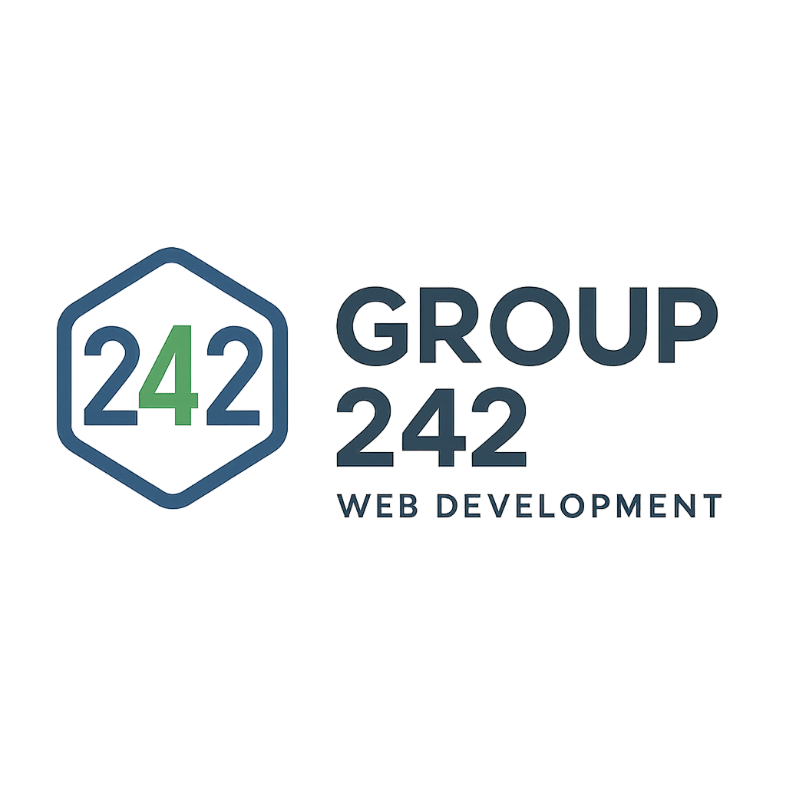

# Portfolio Website - Group 242

A modern, responsive portfolio website showcasing web design and development services.



## 📋 Overview

This portfolio website is designed for Group 242, a team of web designers and developers. The site features a clean, modern design with responsive layouts using Bootstrap 5. It showcases the team's skills, services, portfolio items, and provides contact information for potential clients.

## ✨ Features

- **Responsive Design**: Fully responsive layout that works on all screen sizes and devices
- **Modern UI**: Clean, professional design with smooth animations
- **Navigation**: Fixed navigation bar for easy site exploration
- **Hero Section**: Attention-grabbing hero section with call-to-action buttons
- **About Section**: Team biography with contact details and social media links
- **Services Section**: Highlights key services offered by the team
- **Skills Section**: Visual representation of technical skills with progress bars
- **Portfolio Section**: Showcase of successful projects with image overlays
- **Bootstrap 5**: Utilizes the latest Bootstrap framework for responsive grids and components
- **Font Awesome**: Integration of Font Awesome icons
- **Animate.css**: Smooth animations for enhanced user experience

## 🛠️ Technologies Used

- HTML5
- CSS3
- Bootstrap 5.3.0
- Font Awesome 6.0.0
- Animate.css 4.1.1
- JavaScript (via Bootstrap)


## 🚀 Getting Started

### Prerequisites

- Web browser (Chrome, Firefox, Safari, Edge)
- Basic understanding of HTML/CSS (for customization)

### Installation & Setup

1. **Clone the repository**
   ```bash
   https://github.com/RisperNJW/web-development-group-242.git
   ```

2. **Navigate to the project directory**
   ```bash
   cd portfolio-website
   ```

3. **Open in browser**
   - Double-click on `index.html` or open it with your preferred browser

### Customization

1. **Personal Information**:
   - Update name, email, phone, and location in the About section
   - Replace social media links with your own

2. **Images**:
   - Replace logo image in the `images/` directory
   - Add hero image to the `images/` directory
   - Update portfolio project images

3. **Content**:
   - Modify service descriptions
   - Update skill percentages
   - Add your own portfolio projects

4. **Styling**:
   - Customize colors and styles in `scr/styles.css`

## 📱 Sections

### 1. Navigation
Fixed navigation bar with links to all sections and a responsive hamburger menu for mobile devices.

### 2. Hero Section
Full-height hero section with an image background, overlay, animated headings, and call-to-action buttons.

### 3. About Section
Team biography with profile image, contact information, social media links, and downloadable CV.

### 4. Services Section
Highlights three main services: Web Development, App Development, and UI/UX Designing.

### 5. Skills Section
Displays technical skills in four categories:
- UI/UX Design
- Frontend Development (HTML/CSS, JavaScript, Bootstrap)
- Backend Development (Node.js, PHP, MySQL)
- Tools & Technologies (GitHub, Figma, VS Code)

### 6. Portfolio Section
Showcases four featured projects with images, descriptions, and interactive overlays.

## 🔧 Missing/To-Do Items

The following items need to be addressed to complete the website:

1. **Images**: 
   - Add a hero background image
   - Complete the portfolio images collection

2. **Contact Section**:
   - Implement contact form functionality
   - Add form validation

3. **CSS Customization**:
   - Define custom color scheme in the styles.css file
   - Create custom styles for the progress bars and buttons

4. **JavaScript**:
   - Add portfolio filtering functionality
   - Implement smooth scrolling for navigation links

## 📄 License

This project is licensed under the MIT License - see the LICENSE file for details.

## 👥 Contributors

- Group 242 - Web Designers & Developers


